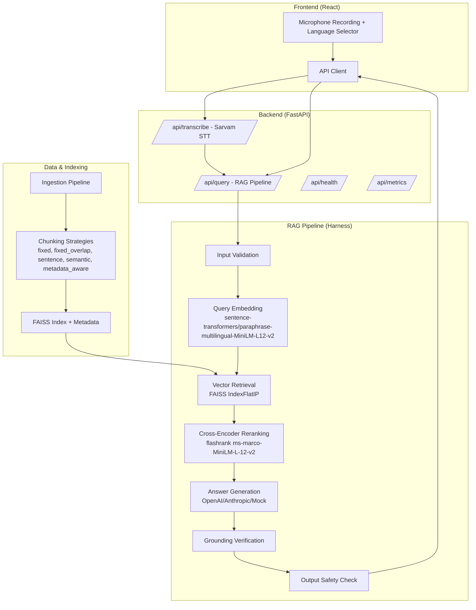

# Voice-Enabled RAG System for HackerHouse 2026

A production-quality Voice-Enabled Retrieval-Augmented Generation (RAG) system built with the MSMARCO-XI dataset, featuring multi-strategy chunking, FAISS vector retrieval, cross-encoder reranking, LLM answer generation, grounding verification, and comprehensive guardrails.

## Architecture Overview



## Features

- **Speech-to-Text**: Sarvam AI integration with mock fallback for development
- **Multi-Strategy Chunking**: 5 chunking strategies (fixed, fixed_overlap, sentence, semantic, metadata_aware)
- **Multilingual Embeddings**: `paraphrase-multilingual-MiniLM-L12-v2` (384-dim, 15 Indic languages)
- **Vector Search**: FAISS IndexFlatIP with cosine similarity
- **Reranking**: Cross-encoder reranking with flashrank
- **Answer Generation**: Configurable LLM providers (OpenAI, Anthropic) with structured JSON output
- **Grounding Verification**: Word overlap + confidence threshold validation
- **Guardrails**: Input validation, retrieval quality, output safety (PII detection)
- **Latency Tracking**: Per-component P50/P70/P90/P95/P99/P100 percentiles
- **Target Latency**: <200ms P50 (achieved: **56.78ms**)

## Quick Start

### Prerequisites

- Python 3.10+
- Node.js 18+
- 2GB+ disk space for models and index

### Backend Setup

```bash
cd backend

# Install dependencies
pip install -r requirements.txt

# Create environment file
cp .env.example .env
# Edit .env with your API keys (optional - runs in mock mode without keys)

# Build FAISS index (uses synthetic data by default)
python -m ingestion.build_index

# Run benchmark
python benchmarks/run_benchmark.py --num-queries 100 --output-dir reports/benchmark_results

# Start API server
uvicorn app.main:app --host 0.0.0.0 --port 8000
```

### Frontend Setup

```bash
cd frontend

# Install dependencies
npm install

# Start development server
npm start
```

Open http://localhost:3000 to use the voice-enabled RAG interface.

## Configuration

### Environment Variables

| Variable | Description | Default |
|----------|-------------|---------|
| `SARVAM_API_KEY` | Sarvam STT API key | - |
| `LLM_API_KEY` | OpenAI/Anthropic API key | - |
| `LLM_PROVIDER` | `openai` or `anthropic` | `openai` |
| `LLM_MODEL` | Model name | `gpt-4o-mini` |
| `MOCK_LLM` | Use mock generation | `true` |
| `EMBEDDING_MODEL` | Embedding model | `sentence-transformers/paraphrase-multilingual-MiniLM-L12-v2` |
| `TOP_K` | Initial retrieval count | `10` |
| `RERANK_TOP_K` | Rerank output count | `5` |
| `RELEVANCE_THRESHOLD` | Min relevance score | `0.3` |
| `INDEX_DIR` | FAISS index directory | `./indexes` |

See `.env.example` for all options.

## API Endpoints

### `GET /api/health`
Health check with service status.

```json
{
  "status": "healthy",
  "version": "1.0.0",
  "index_loaded": true,
  "embedding_model_loaded": true
}
```

### `POST /api/transcribe`
Transcribe audio file using Sarvam STT.

**Request**: Multipart form with `audio` file and `language` parameter.

```json
{
  "request_id": "uuid",
  "transcription": "What is the capital of India?",
  "language": "en",
  "confidence": 0.95,
  "latency_ms": 150.0
}
```

### `POST /api/query`
Process RAG query.

**Request**:
```json
{
  "query": "What is the capital of India?",
  "language": "en",
  "top_k": 10
}
```

**Response**:
```json
{
  "request_id": "uuid",
  "query": "What is the capital of India?",
  "language": "en",
  "answer": "New Delhi is the capital of India.",
  "grounded": true,
  "confidence": 0.95,
  "citations": [
    {
      "chunk_id": "doc_123_chunk_0",
      "document_id": "doc_123",
      "source": "synthetic",
      "score": 0.996,
      "text_preview": "New Delhi is the capital city of India..."
    }
  ],
  "latency": {
    "query_embedding_ms": 15.2,
    "retrieval_ms": 3.1,
    "reranking_ms": 28.4,
    "generation_ms": 0.5,
    "grounding_ms": 0.1,
    "guardrails_ms": 0.3,
    "total_rag_ms": 47.6,
    "total_ms": 47.6
  },
  "refused": false,
  "retrieved_chunks": [...]
}
```

### `GET /api/metrics`
System metrics (placeholder for production metrics store).

## Benchmarking

Run latency benchmarks:

```bash
python benchmarks/run_benchmark.py --num-queries 100 --output-dir reports/benchmark_results
```

Generates:
- `latency.json` - Full results
- `latency.csv` - Per-query latencies
- `latency_report.md` - Human-readable report

### Latest Results (100 queries)

| Metric | Latency |
|--------|---------|
| **P50** | **56.78ms** ✅ |
| P70 | 61.61ms |
| P90 | 87.57ms |
| P95 | 188.16ms |
| P99 | 207.80ms |
| P100 | 766.78ms |
| Mean | 74.09ms |

| Component | Avg Latency |
|-----------|-------------|
| Embedding | 27.78ms |
| Retrieval | 2.75ms |
| Reranking | 43.47ms |
| Generation | 0.02ms |
| Grounding | 0.06ms |

✅ **P50 latency (56.78ms) is UNDER 200ms target**

## Testing

```bash
# Run all tests
python -m pytest tests/ -v

# Run specific test suite
python -m pytest tests/test_api.py -v
python -m pytest tests/test_guardrails.py -v
python -m pytest tests/test_chunkers.py -v
```

All 30 tests pass covering:
- API endpoints (health, metrics, query, transcribe)
- Chunking strategies (5 strategies)
- Guardrails (input validation, retrieval quality, grounding, output safety)

## Project Structure

```
rag-hackerhouse/
├── backend/
│   ├── app/
│   │   ├── config.py              # Pydantic settings
│   │   ├── main.py                # FastAPI app
│   │   ├── models/schemas.py      # Pydantic models
│   │   └── services/
│   │       ├── stt/               # Sarvam STT
│   │       ├── embeddings/        # SentenceTransformer embeddings
│   │       ├── retrieval/         # FAISS retrieval
│   │       ├── reranking/         # Flashrank reranker
│   │       ├── generation/        # LLM generation
│   │       ├── guardrails/        # Safety & validation
│   │       └── harness/           # Pipeline orchestration
│   ├── ingestion/
│   │   ├── chunkers/              # 5 chunking strategies
│   │   ├── build_index.py         # Offline index builder
│   │   └── create_synthetic_data.py
│   ├── benchmarks/
│   │   └── run_benchmark.py       # Latency benchmarking
│   ├── tests/                     # Unit & integration tests
│   ├── indexes/                   # FAISS index files
│   ├── data/                      # Synthetic dataset
│   └── reports/                   # Benchmark reports
├── frontend/
│   ├── src/
│   │   ├── App.js                 # React component
│   │   ├── App.css                # Styling
│   │   └── index.js               # Entry point
│   ├── public/index.html
│   └── package.json
├── .env.example
└── README.md
```

## Dataset

Uses **MSMARCO-XI** (11.4M rows, 15 Indic languages) - or synthetic data matching the schema:
- `query_id`, `query`, `Eng_Query`
- `target_lang`, `passages`, `positive_passages`
- `negative_passages`, `hard_negative_passages`

Synthetic data: 5000 records, 5 languages (en, hi, bn, ta, te), 37,802 chunks.

## License

MIT License - Built for HackerHouse 2026